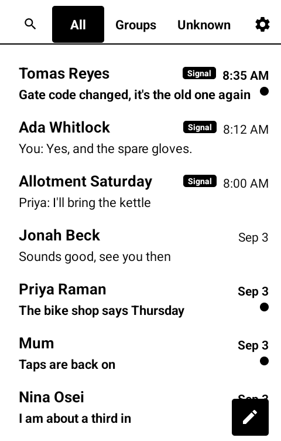
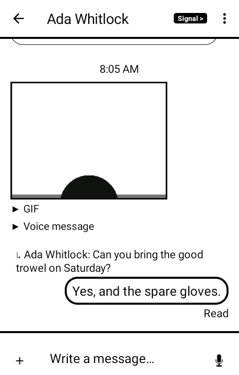

# 言伝 kotozute — Messaging

An SMS and MMS app for the [Mudita Kompakt](https://mudita.com/products/kompakt/), restyled for the phone's e-ink screen, with two things bolted on that the phone cannot otherwise have: **Desktop Sync**, reading and replying from a browser on a computer, and **Signal**, in the same inbox as your texts.

*Kotozute* is 言伝 — word left with someone to carry the rest of the way. The 伝 is the one in
人づて (*hitozute*, by way of a person) and 伝える (to convey). It names what is handed over rather
than the machinery that carries it, which is the point: the phone, the cell tower and the browser
are all just the someone in the middle.

It continues [QKSMS](https://github.com/moezbhatti/qksms) by way of [QUIK](https://github.com/octoshrimpy/quik), and branched off [InkMessage](https://github.com/lamdanAmiti/InkMessage), which is where the e-ink work started.

| | |
|---|---|
|  |  |
|  |  |

Desktop Sync, which is the page the phone serves to a browser on your own computer:


## Matching the stock Mudita SMS app

Measured against the stock app rather than guessed at:

- No avatars — the stock app identifies a conversation by its title, not by per-message circles
- Bubble borders: thin solid incoming, thick solid outgoing (upstream had these reversed, with a dashed outgoing border)
- Sender names always bold; message previews bold only when unread
- Lato is bundled statically. Upstream loaded it through Google Play Services' downloadable-fonts provider, which silently does nothing on a degoogled phone, so the font never rendered on a Kompakt
- Black and white only. E-ink dithers colour to muddy grey, so the accent-colour system always resolves to black
- Consistent icon weights, and chevrons on navigable settings rows

## Desktop Sync

An HTTP + WebSocket server runs *inside the app on the phone* and serves its own web dashboard. Your browser talks directly to the phone: no cloud service, no relay server in between.

- Conversation list with instant search
- Full thread history, paging back through long conversations
- Send replies, and start new conversations with contact autocomplete (by name or number)
- Pictures and video display inline and play in place, on both rails
- Right-click a conversation for archive, pin, mute, mark unread, block or delete; right-click a message to copy, forward, delete it, or put an emoji on it
- An archive shelf and a blocked list, so nothing filed away is out of reach
- Cross between someone's SMS and Signal threads from a badge in the thread header
- Safety numbers, the Signal account and the devices on it
- Settings: theme, unread-at-the-top, the Signal switches, Tailscale only, and a sync you can trigger from the browser
- Scheduled messages on both rails: write one now, pick a time, and the phone sends it whether
  or not the browser is still open — and see what is waiting, and cancel it
- Reading a thread in the browser marks it read on the phone and clears its notification
- Live updates over a WebSocket, with polling as a fallback
- The access link can be reset if it leaks

It is a page for a computer. There are no responsive breakpoints and none are planned: the
phone that serves this already has the app on it. Opened on a phone anyway it scales the
whole layout down to fit rather than breaking, but it will be small.

### Setup

1. In the app: **Settings → Desktop Sync**, and switch it on.
2. Tap **Show link**. It gives you the address to open on your computer and a six-digit code to type in, which saves reading a long token off an e-ink screen. The code lasts three minutes and works once. The full link is there too if you would rather paste that; either way the browser remembers, so the bookmark is just the address.
3. Switch it off again with the same row, or **Stop** on the notification. It is off by default and never starts on its own.
4. If the link is ever shared or seen by someone else, **Reset Desktop Sync link** mints a new token. Existing bookmarks and open tabs stop working immediately.

### Access control

Two independent gates.

*Where you can connect from.* **Tailscale only** is on by default: any request from outside your [Tailscale](https://tailscale.com/) tailnet is refused before the token is even looked at, so another device on your café or home Wi-Fi cannot reach the dashboard even if it somehow had your link. This also means your messages are never in the clear on a network — the relay speaks plain HTTP, but every tailnet connection is encrypted end to end by Tailscale itself.

Turn the switch off and it also accepts LAN connections, which is worth knowing about for one case: **Tailscale does not start by itself after a reboot** on MuditaOS, which has no always-on VPN toggle. Until you open Tailscale, a restricted relay refuses everyone — Settings says so plainly when that happens.

The restriction is enforced per request rather than by binding only the tailnet address, deliberately: binding it would mean the server cannot start at all while Tailscale is down, so a reboot could leave the relay dead. This way the socket always binds and simply turns non-tailnet callers away.

*Who you are.* Every request also needs a random 120-bit token generated on first run, so being on the tailnet isn't enough by itself — useful if your tailnet has devices you don't fully control.

Don't port-forward the port, and don't expose it with Tailscale Funnel.

Desktop Sync needs the `INTERNET` permission, which InkMessage deliberately left disabled and this app re-enables for exactly this feature. Leave it off and no server is ever started.

### Launcher badges

Desktop Sync runs as a foreground service, which means Android keeps a notification in the shade for as long as the relay is up — that's how the platform works, and it's also your only visible sign the relay is running. Some minimalist launchers count *every* notification a package has posted when deciding whether to badge its icon, without checking whether the notification asked to be badged. On those launchers the relay's notification will light up an unread marker on Messaging that never clears.

The notification lives on its own channel (`desktop_sync_v2`) and declares `setShowBadge(false)` plus `CATEGORY_SERVICE`, so a launcher that honours either one will behave. If yours doesn't, open the notification's channel settings — the cog next to it in the shade — and switch that one channel off. Real messages badge from a different channel and are unaffected. The cost is that you lose the shade indicator telling you the relay is running.

## Signal

Signal threads sit in the same conversation list as your texts, newest first, with a badge on
the rows that came over Signal. Nothing is marked SMS: unmarked means SMS, which keeps the badge
off nearly every row.

- Send and receive, one-to-one and in groups, with pictures
- React to a message: hold it and pick an emoji, or hold it again to take yours back
- Write one now and send it later, from the same scheduled list your texts use
- The same person's SMS and Signal threads are separate conversations, and the badge in either
  one crosses to the other
- Search reaches message bodies on both rails at once, from the phone or the browser
- Disappearing messages disappear, and a view-once photo is never stored
- Safety numbers, with a loud warning when someone's key has changed
- Pin, mute, mark unread, archive, block, and a details screen with the pictures a conversation
  has carried
- Bring old messages across from a Signal Desktop export

### What it needs

Nothing but the phone. Signal runs in the app: it holds a Signal identity of its own and talks
to Signal's servers directly, with nothing in between.

There are two ways in, both under Settings → Signal.

**Link this phone**, which is the ordinary one. On a phone that already has your Signal, open
Settings → Linked devices → Link new device, and scan the code this one shows — the same
exchange that links Signal Desktop.

**Register this number**, for a phone that is the only Signal you have. This makes it *become*
the account for that number: if that number is on Signal anywhere else, that stops working and
its linked devices are dropped, and the messages already on the other phone stay there. It
needs a number that can receive a text from a short code — Google Voice and most other
internet numbers cannot, and neither can they take the call — and there is a "call me with the
code instead" option for when the text does not come.

**There is no push, so the app collects its own messages.** Signal does not send notifications
to anything but its own clients, so how quickly a message arrives is decided by **Keep Signal
connected**. On, a foreground service holds the connection open and messages arrive as they are
sent, at the cost of a permanent notification. Off, which is the default, Signal catches up
every so often and when you open the app. Measured on the phone in forced deep idle, with the
app backgrounded: with the switch on the message arrives, with it off nothing arrives until
the next catch-up.

**Threads start empty.** Signal's servers do not hold history and a newly linked device is not
sent any, so conversations fill from the day you pair. Importing a Signal Desktop export is how
you get the rest.

#### The bridge, which used to be the way in

Before the app could be a Signal device in its own right, Signal ran on a computer of your own
and the phone talked to it over a bridge. **The app no longer has a bridge in it.** There is
nothing to pair and nothing behind Advanced; the phone holds its own place on the account and
that is the only path.

The bridge itself is still in this repository, and it is still worth one thing: a phone that
used to be on a bridge has messages whose pictures were never on it — the phone kept the
attachment's id and asked the bridge for the file when you opened it. Nobody is left to ask.
`kotozute-bridge --export <folder>` writes those files out, and **Settings → Signal → Bring
history in** reads that folder and keeps them for good. Do that before retiring the bridge,
not after.

Nothing else is lost by it going. Reactions, blocking and read receipts were the bridge's to
send and the phone sends them itself now. The one thing that did not survive is the list of
other devices on the account: the bridge could ask signal-cli, and the phone's Signal library
has no way to ask at all, so the account screen says which device this phone is and stops
there.

### What is not possible

Worth saying plainly, so nobody goes looking:

- **No Signal calls.** The app registers itself as carrying neither voice nor video, and there
  is no audio path in it.
- **No PIN, registration lock, number change or account transfer.** Linked to a phone that
  already has Signal, those all belong to that phone. Registered here, they are simply not
  implemented — registration is done without a registration lock, and setting one afterwards
  needs a client that supports it.
- **A linked device dies with its primary.** If the phone holding the Signal account is ever
  unregistered, this one stops with it. That does not apply if this phone registered the number
  itself, because then it is the primary.
- **History does not arrive by itself.** Signal's servers do not hold it and a newly linked device
  is not sent any, so threads start empty and fill from the day you pair. Importing an export is
  how you get the rest.

## Building

Requires **JDK 17** — the project's Kotlin/kapt toolchain fails on JDK 21 with an `IllegalAccessError` about `com.sun.tools.javac`.

```bash
export JAVA_HOME=/usr/lib/jvm/java-17-openjdk-amd64
./gradlew :presentation:assembleRelease
```

The APK lands in `presentation/build/outputs/apk/release/`.

Released builds are signed with a real key supplied through `signing/`, which is gitignored and written by the release workflow from repository secrets. There is no fallback: a clone without it builds an *unsigned* release APK, which will not install anywhere. That is deliberate — a missing signing key should stop you, not quietly hand you something installable. `assembleDebug` still works anywhere, signed with the usual Android debug key.

## Installing

> **Running inkMessage+? Uninstall it first — there is no upgrade path.** This app has a
> different application ID, so Android treats it as unrelated software rather than a newer
> version, and installing over the old one stops with `INSTALL_FAILED_UPDATE_INCOMPATIBLE`.
>
> **Your messages are safe.** They live in Android's own message store, not in this app, and it
> reads them back the first time it runs — on a long history that takes several minutes, showing
> "Syncing messages…" over an empty list until it finishes. What uninstalling clears is the app's
> own settings, so expect to make it your default SMS app again and to turn Desktop Sync back on.

Sideload the APK and let Android make it your default SMS app; it then imports your existing messages from the system SMS database. It installs *alongside* the stock Mudita SMS app rather than replacing it, so you can switch back whenever you like.

Also inherited from upstream: scheduled messages, backup/restore, blocking, archiving, voice messages, attachments of any file type, and delayed sending.

## Credits

Standing on a lot of other people's work:

- **QKSMS** — [Moez Bhatti](https://github.com/moezbhatti), where almost all of this code comes from
- **QUIK** — [Marcos Jones (octoshrimpy)](https://github.com/octoshrimpy), who kept it alive — [Liberapay](https://liberapay.com/octoshrimpy/donate) · [Ko-Fi](https://ko-fi.com/octoshrimpy/donate) · [Patreon](https://patreon.com/octoshrimpy)
- **InkMessage** — [lamdanAmiti](https://github.com/lamdanAmiti), who took it to e-ink first, and where this branched off
- **android-smsmms** — [Jake](https://github.com/klinker41) and [Luke Klinker](https://github.com/klinker24)
- Typography and visual language follow Mudita's [MMD](https://github.com/mudita) design system

## Getting it, and keeping it

Download <https://github.com/wanderwildwood/kotozute/releases/latest/download/kotozute.apk> and
sideload it. That address always points at the newest release, and every release publishes a
`.sha256` beside the APK if you would rather check than trust.

For updates without doing this by hand, add this repository to
[Obtainium](https://github.com/ImranR98/Obtainium):

    https://github.com/wanderwildwood/kotozute

It will offer each new release as it appears. **The application id is settled** — updates
install over what you have, keeping your settings and anything the app has stored.

## Not affiliated with Signal

This is not a Signal product, and has no connection to the Signal Foundation or Signal
Messenger LLC. It is an unofficial, third-party client. It speaks to Signal's servers directly,
as a device linked to or registered on your account, using Signal's own published libraries —
libsignal, and a fork of Signal's service layer. Before the bridge was removed it could instead talk to
[signal-cli](https://github.com/AsamK/signal-cli), which is also a separate and unofficial
project.

"Signal" is used here to name the service being reached, and for nothing else. Whether a
third-party client suits you is your judgement to make, and worth making deliberately — an
account reached this way is still your account, with everything that implies, and none of this
code has been reviewed by anyone at Signal.

## Licence

**GPL-3.0-only**, inherited from QKSMS by way of QUIK and InkMessage — see [LICENSE](LICENSE)
for the full text.

This is not a licence that can be changed here. The code this is built on is GPLv3, so this is
GPLv3, and so is anything built on this in turn: distributing it means carrying the same terms
and offering the corresponding source.

Copyright in the work added by this fork is held by wander wildwood. The upstream copyrights —
Moez Bhatti's on QKSMS, and those of the QUIK and InkMessage contributors — are untouched and
still apply to the code they cover.

### The Signal libraries, and what they add

Builds that include Signal support link two further sets of code, and one of them is not GPL:

- **libsignal** (`org.signal:libsignal-android`) is **AGPL-3.0**.
- **signal-service** (`com.github.turasa:signal-network`, a fork of Signal's own service
  layer) is **GPL-3.0**.

GPLv3 §13 expressly permits combining a GPLv3 work with an AGPLv3 one, so the combination is
allowed. It does not make the AGPL part GPL: libsignal stays AGPL-3.0 inside the result, and
its terms — including the network-use clause — continue to apply to it. Saying the built
application is simply "GPL-3.0-only" would therefore be inaccurate about part of what is
inside it.

The practical obligation is the one this project already meets: the corresponding source for
everything distributed is available, libsignal's included, and neither library is modified
here. Anyone redistributing a build should carry this notice with it rather than restate the
licence as GPL alone.
